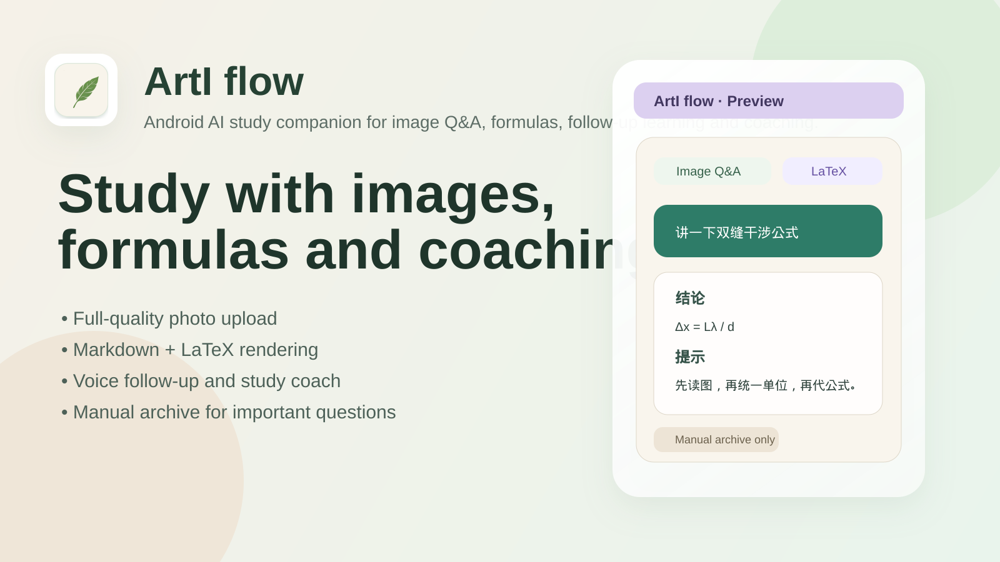
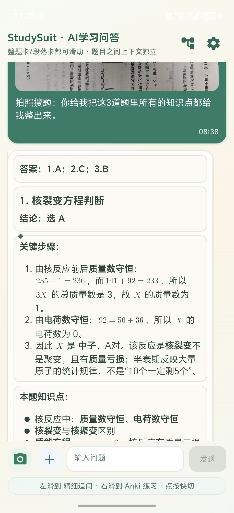
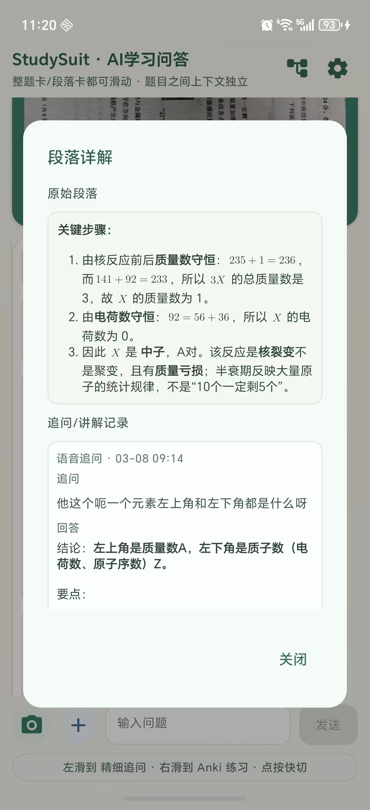
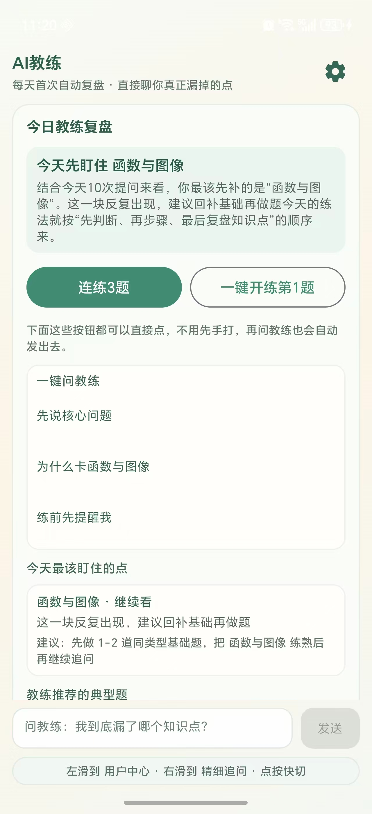
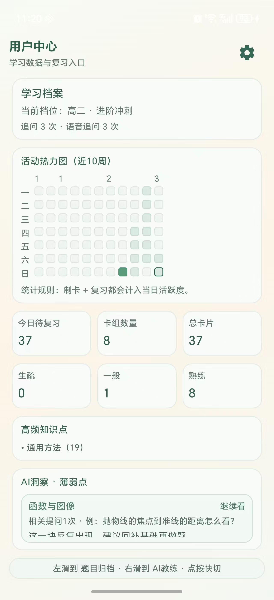
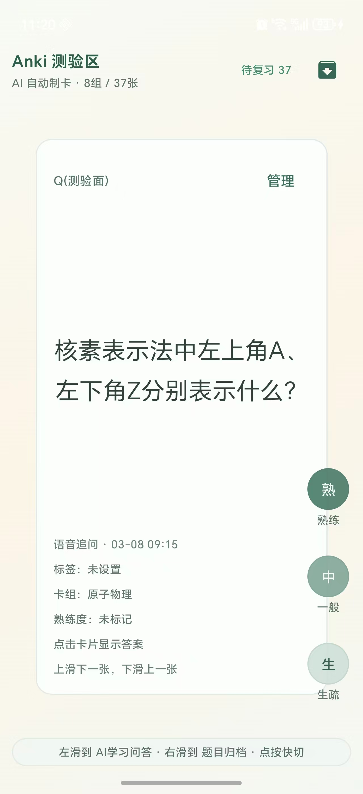

# ArtI flow

<div align="center">
  

  <h3>一个面向中学学习场景的 Android AI 辅导应用</h3>
  <p>支持拍照搜题、LaTeX 公式渲染、语音追问、学习教练、题目归档与复习辅助。</p>

  <p>
    
    
    
    
    
  </p>
</div>

<p align="center">
  
</p>

## 🎬 Demo

<p align="center">
  
</p>

<p align="center">
  使用 `screenshots/demo.mp4` 生成的真实录屏演示，展示图片问答、追问解析、教练复盘与学习切换流程。
</p>

## 📸 Screenshots

<p align="center">
  
  
  
</p>

<p align="center">
  
  
</p>

<p align="center">
  学习问答 · 段落讲解 · AI 教练复盘 · 用户中心 · Anki 测验
</p>

---

## 🎯 交互亮点

**左滑继续表达，右滑继续展开。**

ArtI flow 的核心是一套面向学习场景的滑动交互。你看到题目解析时，不用退出当前内容，不用重新组织语言，也不用在一堆按钮里找功能，直接通过左右滑动，就能在自动讲解、语音追问、段落详解、精细追问之间切换。

当你看到某一段没懂时，左滑一下，可以让 AI 顺着这一段继续讲；左滑后停住，可以马上进入语音追问，想到什么就直接说。

如果你想把某一段再拆细一点，右滑松手可以打开详解；右滑并停住，会直接进入这道题当前上下文下的精细追问链，追问会持续围绕这道题往下走。

这套设计把学生最常见的下一步动作——没懂、想继续听、想开口问、想往深处追——都做成了顺手动作。很多时候学生有问题，只是不想重打、不想切页面、不想重新描述。滑一下，学习就继续下去了。

左滑偏表达，右滑偏展开。每一次滑动，都是一次清楚的学习动作，整个过程更连贯，也更接近真实做题时的节奏。

---

## ✨ 项目亮点

- **左右滑动交互**：左滑继续表达，右滑继续展开，讲解、追问、详解都能顺着当前内容继续
- **拍照搜题 / 相册搜题**：支持直接上传题目图片，并保留原图质量
- **Markdown + LaTeX 渲染**：适合数学、物理公式展示，兼顾列表与块公式排版
- **语音追问**：支持语音录入与追问式学习交互
- **学习教练模式**：给出复盘建议、训练题、针对性 follow-up
- **完整错题本**：支持拍照/相册录入、OCR 与多模态识别、记忆曲线复习提醒、模型判题建议和完成判定
- **题目归档**：可手动收藏题目，沉淀题干、答案、标签与分析摘要
- **Anki 辅助**：支持面向记忆卡片的学习延展能力
- **FlowStudy 对接**：支持配对与上传主界面内容

---

## 🧠 适合什么场景

ArtI flow 更适合「**学中用**」场景：

- 做题时直接拍照提问
- 看不懂某一步时继续追问
- 需要公式正常显示，不想看成一大段纯文本
- 想把好题、易错题沉淀下来反复看
- 想让 AI 像一个学习教练，给出具体建议和下一步训练方向

---

## 🧩 主要功能

| 模块 | 说明 |
| --- | --- |
| 图片问答 | 拍照 / 相册导入题目图片，支持多图场景 |
| 公式显示 | 渲染行内公式、块公式、列表中的公式内容 |
| 语音输入 | 录音后转写，用于追问或继续提问 |
| 教练模式 | 根据最近内容生成建议、练习方向和提示 |
| 题目归档 | 手动收藏整题，保留题干、答案、知识点标签 |
| 错题本 | 拍照录入、模型识别、按记忆曲线推送复习、统计做对情况并自动完成 |
| 学习沉淀 | 支持导出、复盘、错题整理与卡片延展 |

---

## 🛠 技术栈

- **Kotlin**
- **Jetpack Compose**
- **Material 3**
- **OkHttp**
- **Markwon**
- **JLatexMath**
- **Gradle Kotlin DSL**

---

## 🚀 快速开始

### 1) 克隆仓库

```bash
git clone https://github.com/vimalinx/ArtIflow.git
cd ArtIflow
```

### 2) 配置本地参数

先复制配置模板：

```bash
cp local.properties.example local.properties
```

然后按需填写：

- `ARK_API_KEY`
- `ARK_MODEL`
- `ARK_BASE_URL`
- `ARK_ENDPOINT`
- `OPENSPEECH_API_KEY`
- `OPENSPEECH_RESOURCE_ID`
- `FLOWSTUDY_SERVER_URL`（可选）

> `local.properties` 不要提交到仓库。

### 3) 运行项目

如果你使用 Android Studio：

- 直接打开项目根目录
- 等待 Gradle Sync
- 运行 `app` 模块即可

也可以命令行安装调试包：

```bash
./gradlew :app:installDebug
```

---

## 🔧 常用命令

### 编译

```bash
./gradlew :app:compileDebugKotlin
```

### 单元测试

```bash
./gradlew :app:testDebugUnitTest
```

### 安装到设备

```bash
./gradlew :app:installDebug
```

### 无线调试设备示例

```bash
adb connect <手机IP:端口>
adb devices -l
./gradlew :app:installDebug
```

---

## 📁 项目结构

```text
ArtIflow/
├── app/
│   ├── src/main/java/com/studysuit/aiqa/
│   │   ├── data/        # API 客户端、导出、标签分析等
│   │   ├── ui/          # Compose UI、聊天、教练、归档、Markdown/LaTeX
│   │   └── MainActivity.kt
│   ├── src/main/res/
│   └── build.gradle.kts
├── docs/
│   └── assets/          # README 展示图、封面、GIF、logo
├── gradle/
├── local.properties.example
└── README.md
```

---

## 🔐 配置说明

项目默认读取 `local.properties` 中的运行参数，并在构建时注入到 `BuildConfig`。

示例配置文件见：`local.properties.example`

建议：

- 公开仓库只保留模板，不提交真实密钥
- 自建模型地址优先使用测试 key，不要把生产 key 放进公开历史
- 如果切换无线调试设备，优先重新获取新的 `adb connect` 端口

---

## 🧪 当前开发关注点

- 图片问答体验优化
- 公式与 Markdown 混排稳定性
- 教练模式的推荐与训练闭环
- 归档、复习与学习沉淀体验

---

## 🤝 贡献方式

如果你想继续完善这个项目，可以从这些方向入手：

- UI 打磨与交互细节优化
- 图片问答与多图理解体验
- 公式渲染边界场景补测试
- 教练模式提示词与训练流程优化
- Demo、截图、使用文档持续补强

---

## 📌 说明

这是一个持续迭代中的学习型 Android 项目，适合继续扩展为：

- 更完整的错题本
- AI 学习教练
- 题目归档与检索系统
- Anki / 导出 / 复盘一体化工具

如果这个项目对你有帮助，欢迎点个 ⭐。
